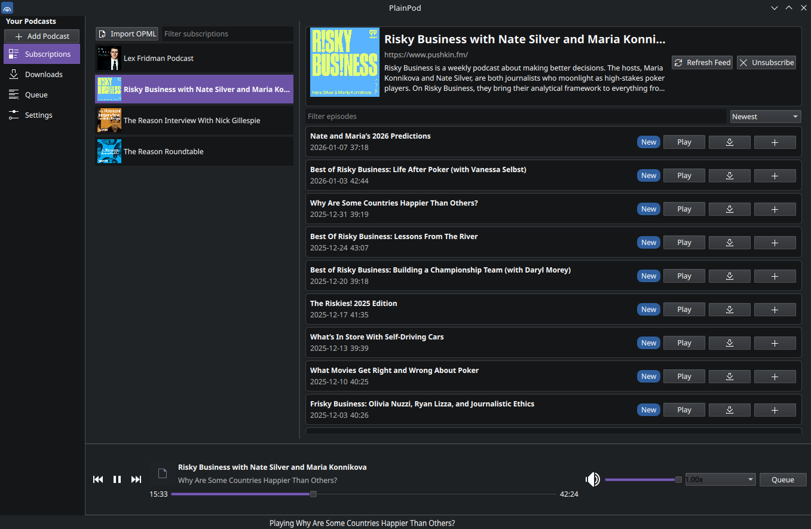
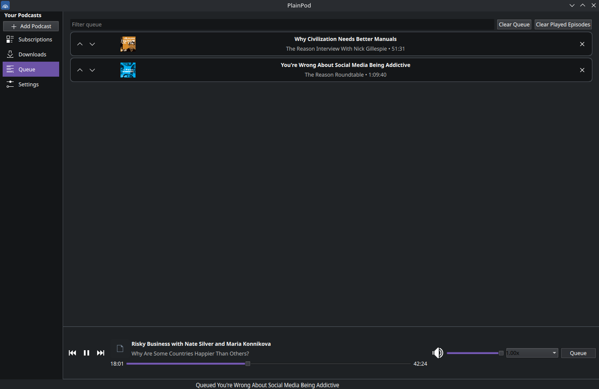
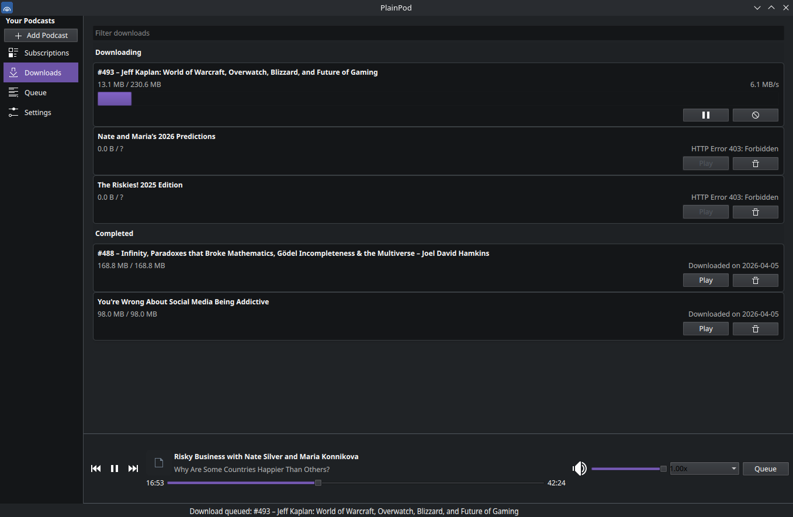

# PlainPod 

PlainPod is a simply a podcast player with a layout that doesn't  add too much complexity or hide features behind multi dropdown menu's.
This is personal preference as I found most linux native podcast players feature rich but clunky, probably because they are  feature rich, tradeoffs. 

### Subscription


This initial version implements:

- Feed subscription and basic refresh
- Podcast and episode persistence (SQLite)
- Episode queue state persistence
- Basic playback state persistence
- Episode streaming URL handoff to player
- Episode download to local storage
- OPML import/export


### Queue


### Download



## To be implemented

The architecture separates concerns so the product can grow toward the full KDE-native vision:

- Chapters/transcripts are stored, will be eventually accessible in some  form
- MPRIS/system tray integration
- Auto download on per podcast basis

## Run

```bash
python -m venv .venv
source .venv/bin/activate
pip install -r requirements.txt
python -m plainpod
```

## To be implemented

This scaffold intentionally keeps some functionality minimal while providing the structure for expansion:


## Data location

By default, app data lives under:

- Linux: `${XDG_DATA_HOME:-~/.local/share}/plainpod`

DB: `plainpod.db`
Downloads: `downloads/`

