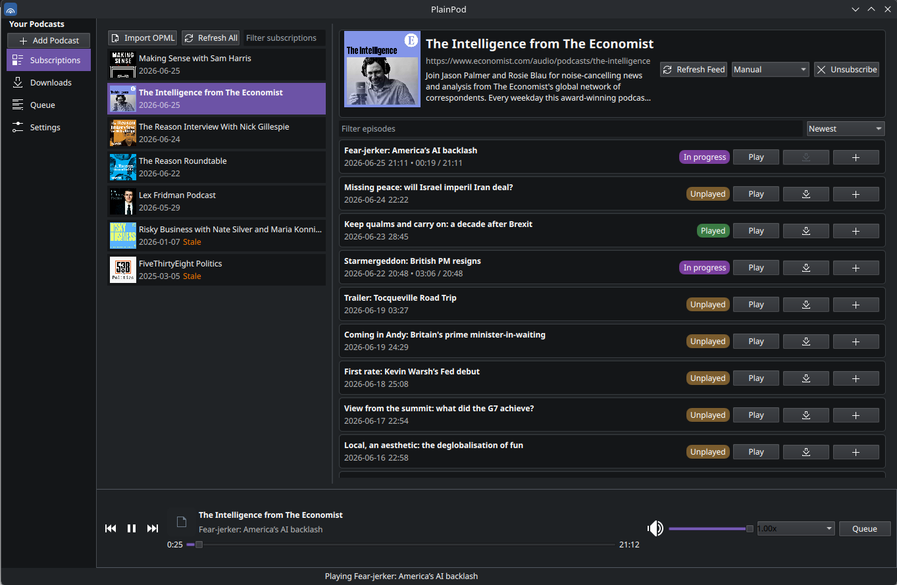
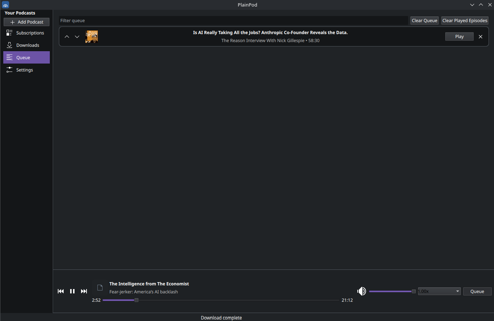
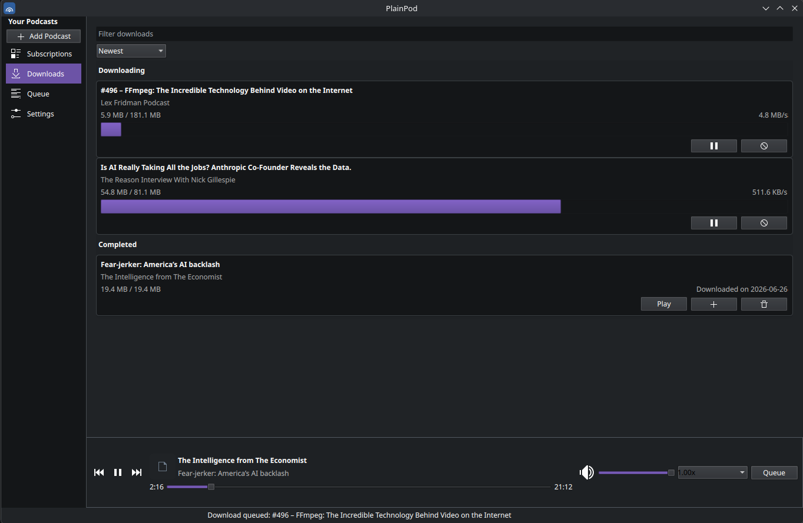
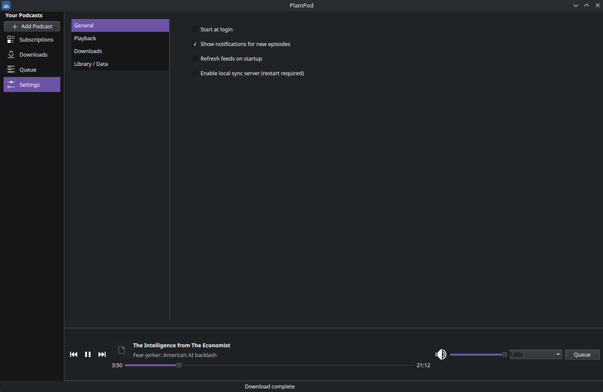

# PlainPod 

PlainPod is a simple podcast player for linux desktops with clean UI

### Subscription


Current version implements:

- Feed subscription and basic refresh
- Podcast and episode persistence (SQLite)
- Per podcast auto download  settings
- Episode queue state persistence
- Basic playback state persistence
- Episode streaming URL handoff to player
- WIP gpod like sync server
- Episode download to local storage
- OPML import/export
- MPRIS/system tray integration 

### Queue


### Download


### Download


## What this is not
 - No mobile app
 - No discovery, you find an RSS feed and add manually
 - Not optimized for non desktop usage
 - Not likely to have any of those four in near future

## Run

```bash
python -m venv .venv
source .venv/bin/activate
pip install -r requirements.txt
python -m plainpod
```
[Or get the flatpack (.flatpakref)](https://github.com/jnesew/PlainPod/releases/latest/download/plainpod.flatpakref)

## Data location

By default, app data lives under:

- Linux: `${XDG_DATA_HOME:-~/.local/share}/plainpod`

DB: `plainpod.db`
Downloads: `downloads/`

